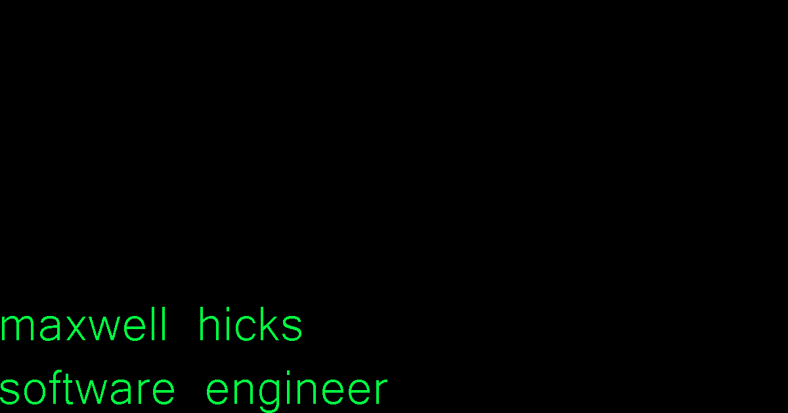

# maxwellhicks.dev

My personal portfolio: a terminal-inspired site showcasing my projects, skills, and background as a software engineer.

**Live site: [maxwellhicks.dev](https://maxwellhicks.dev)**



## Features

- **Terminal-style design:** green-on-black theme with Share Tech Mono, built entirely with Tailwind CSS
- **Pages:** Home (hero, highlights, skills), Projects, About, and a custom 404 page
- **Resume download** linked from the header nav and every contact section
- **Fully static:** every route is prerendered at build time for fast loads
- **SEO and sharing:** per-page titles and descriptions, Open Graph and Twitter card images, `sitemap.xml`, and `robots.txt`
- **Accessible:** visible keyboard focus outlines, respects `prefers-reduced-motion`, and responsive down to small phones

## Tech Stack

| Technology   | Version | Purpose |
|--------------|---------|---------|
| Next.js      | 16.1    | App Router, static rendering, metadata, font loading |
| React        | 19.2    | UI |
| TypeScript   | 5.9     | Type safety |
| Tailwind CSS | 4.1     | Styling |
| ESLint       | 9       | Linting with `eslint-config-next` |
| Vercel       | —       | Hosting and continuous deployment |

## Project Structure

```
src/app/
├── layout.tsx       # Root layout: header nav, font, site-wide metadata
├── page.tsx         # Home: hero, highlights, skills, contact
├── projects/page.tsx
├── about/page.tsx
├── not-found.tsx    # Custom 404 page
├── sitemap.ts       # Generates /sitemap.xml
├── robots.ts        # Generates /robots.txt
└── globals.css      # Theme colors, base styles, accessibility rules
public/
├── Maxwell_Hicks_Resume.pdf
└── og-image.png     # Link preview image (1200×630)
```

## Getting Started

**Prerequisites:** Node.js 20.9 or newer, and npm.

```bash
git clone https://github.com/mahicks5/my-portfolio.git
cd my-portfolio
npm install
npm run dev
```

Then open [http://localhost:3000](http://localhost:3000).

| Command         | What it does |
|-----------------|--------------|
| `npm run dev`   | Start the dev server with hot reload |
| `npm run build` | Create a production build |
| `npm run start` | Serve the production build |
| `npm run lint`  | Run ESLint |

## Updating Content

Most content lives in plain arrays at the top of each page, so updates don't require touching layout code:

| To change...             | Edit |
|--------------------------|------|
| Skills                   | The skill arrays at the top of `src/app/page.tsx` |
| Hero highlights          | `HIGHLIGHTS` in `src/app/page.tsx` |
| Projects                 | The `projects` array in `src/app/projects/page.tsx` |
| Coursework               | `COURSEWORK` in `src/app/about/page.tsx` |
| Resume                   | Replace `public/Maxwell_Hicks_Resume.pdf` (keep the filename) |
| Colors                   | The CSS variables at the top of `src/app/globals.css` |
| Site title / description | `metadata` in `src/app/layout.tsx` |

## Deployment

The site is hosted on [Vercel](https://vercel.com). Every push to `main` triggers a new production deployment automatically.

## Contact

- **Email:** [maxwellahicks@gmail.com](mailto:maxwellahicks@gmail.com)
- **LinkedIn:** [linkedin.com/in/maxwell-h-2647622a4](https://www.linkedin.com/in/maxwell-h-2647622a4)
- **GitHub:** [@mahicks5](https://github.com/mahicks5)
